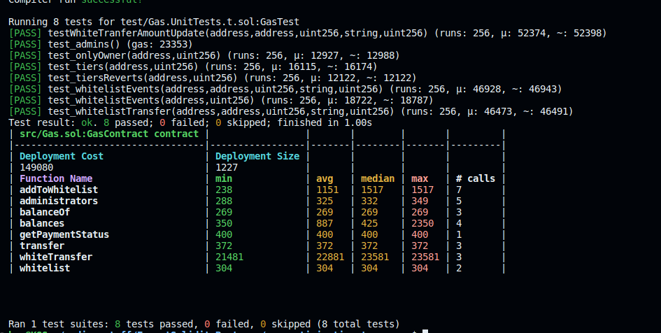

Starting Deployment Cost: &nbsp;&nbsp;2,541,445 gas  
Current Deployment Cost: &nbsp;&nbsp;&nbsp;&nbsp;&nbsp;149,080 gas  
Reduction: 94.1%

# GAS OPTIMISATION

Source project: https://github.com/ExtropyIO/GasOptimisationFoundry
- Your task is to edit and optimise the Gas.sol contract. 
- You cannot edit the tests & 
- All the tests must pass.
- You can change the functionality of the contract as long as the tests pass. 
- Try to get the gas usage as low as possible. 

## To run tests & gas report with verbatim trace 
Run: `forge test --gas-report -vvvv`

## To run tests & gas report
Run: `forge test --gas-report`

## To run a specific test
RUN:`forge test --match-test {TESTNAME} -vvvv`
EG: `forge test --match-test test_onlyOwner -vvvv`

## Generate coverage report
`forge coverage --report lcov`

`genhtml lcov.info -o report --branch-coverage`

## Format code
`forge fmt`
